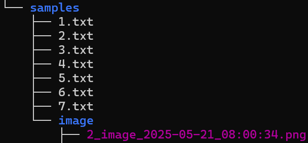
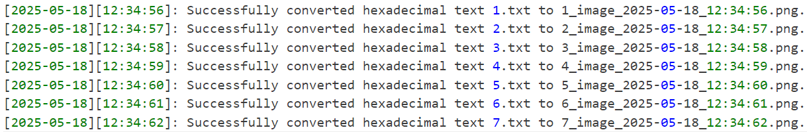

# Sisop-4-2025-IT34
Member :
1. Christiano Ronaldo Silalahi (5027241025)
2. Naila Cahyarani Idelia (5027241063)
3. Daniswara Fausta Novanto (5027241050)

<div align=center>

# Soal Modul 4

</div>

## Soal 1

### a.

Pertama, unduh file zip menggunakan perintah berikut:

```bash
FILEID="1hi_GDdP51Kn2JJMw02WmCOxuc3qrXzh5"
FILENAME="anomali.zip"

CONFIRM=$(wget --quiet --save-cookies cookies.txt --keep-session-cookies --no-check-certificate \
"https://docs.google.com/uc?export=download&id=${FILEID}" -O- | sed -rn 's/.*confirm=([0-9A-Za-z_]+).*/\1/p')

wget --load-cookies cookies.txt "https://docs.google.com/uc?export=download&confirm=${CONFIRM}&id=${FILEID}" \
-O ${FILENAME} 
```

Kemudian, unzip file

```bash
unzip anomali.zip -d .....
```

Setelah proses unzip file, hapus file zip

```bash
rm -r ..... anomali.zip
```

### b.

Buat sebuah *file* hexed.c untuk mengubah string hexadecimal menjadi sebuah gambar ketika file text tersebut dibuka

```bash
$ hexed.c 
```
Berikut adalah kode untuk mengubah string hexadecimal menjadi sebuah gambar

```bash
#define FUSE_USE_VERSION 30
#include <fuse.h>
#include <stdio.h>
#include <string.h>
#include <unistd.h>
#include <fcntl.h>
#include <dirent.h>
#include <errno.h>
#include <sys/time.h>
#include <time.h>
#include <stdlib.h>
#include <libgen.h>
#include <limits.h>

static const char *doc_dirpath = "/home/na-ux315/Documents";
static const char *dl_dirpath = "/home/na-ux315/Downloads";

// Function to reverse a string (excluding extension)
static char *reverse_string(char *str) {
    if (!str) return NULL;
    
    char *dot = strrchr(str, '.');
    int len = dot ? (int)(dot - str) : (int)strlen(str);
    
    for (int i = 0, j = len - 1; i < j; i++, j--) {
        char temp = str[i];
        str[i] = str[j];
        str[j] = temp;
    }
    return str;
}

// Function to log access to downloads folder
static void write_log(const char *path) {
    if (!path) return;

    FILE *logfile = fopen("conversion.log", "a");
    if (!logfile) return;

    time_t now;
    time(&now);
    struct tm *tm = localtime(&now);

    char month[4];
    strftime(month, sizeof(month), "%b", tm);

    char day[4];
    strftime(day, sizeof(day), "%a", tm);

    fprintf(logfile, "%.3s %.3s%3d %.2d:%.2d:%.2d %d: %s\n",
            day, month, tm->tm_mday,
            tm->tm_hour, tm->tm_min, tm->tm_sec,
            tm->tm_year + 1900, path);

    fclose(logfile);
}

void convert_and_log(const char *txt_path, const char *hex_data, size_t data_size);

void auto_convert_all_hex() {
    DIR *dp;
    struct dirent *de;

    const char *input_dir = "samples";
    char filepath[PATH_MAX];

    dp = opendir(input_dir);
    if (!dp) {
        perror("Failed to open samples directory");
        return;
    }

    while ((de = readdir(dp)) != NULL) {
        if (de->d_type == DT_REG && strstr(de->d_name, ".txt")) {
            snprintf(filepath, sizeof(filepath), "%s/%s", input_dir, de->d_name);

            FILE *f = fopen(filepath, "r");
            if (!f) continue;

            fseek(f, 0, SEEK_END);
            long fsize = ftell(f);
            rewind(f);

            char *hex = malloc(fsize + 1);
            if (!hex) {
                fclose(f);
                continue;
            }

            size_t read_len = fread(hex, 1, fsize, f);
            hex[read_len] = '\0';
            fclose(f);

            if (read_len == 0 || strlen(hex) % 2 != 0) {
                free(hex);
                continue;
            }

            size_t len = strlen(hex) / 2;
            char *bin = malloc(len);
            if (!bin) {
                free(hex);
                continue;
            }

            int error = 0;
            for (size_t i = 0; i < len; i++) {
                if (sscanf(hex + 2 * i, "%2hhx", &bin[i]) != 1) {
                    error = 1;
                    break;
                }
            }

            if (!error) {
                char fullpath[PATH_MAX];
                snprintf(fullpath, sizeof(fullpath), "%s/%s", input_dir, de->d_name);
                convert_and_log(fullpath, bin, len);
            }

            free(hex);
            free(bin);
        }
    }

    closedir(dp);
}

void convert_and_log(const char *txt_path, const char *hex_data, size_t data_size) {
    char img_path[PATH_MAX];

    char *txt_copy = strdup(txt_path);                  
    char *base_name = basename(txt_copy);               
    char *dot = strrchr(base_name, '.');
    if (dot) *dot = '\0';

    time_t now = time(NULL);
    struct tm *tm = localtime(&now);

    snprintf(img_path, sizeof(img_path), "samples/image/%s_image_%04d-%02d-%02d_%02d:%02d:%02d.png",
             base_name,
             tm->tm_year + 1900, tm->tm_mon + 1, tm->tm_mday,
             tm->tm_hour, tm->tm_min, tm->tm_sec);

    mkdir("samples/image", 0755);

    FILE *img = fopen(img_path, "wb");
    if (img) {
        fwrite(hex_data, 1, data_size, img);
        fclose(img);

        FILE *log = fopen("conversion.log", "a");
        if (log) {
            fprintf(log, "[%04d-%02d-%02d][%02d:%02d:%02d]: Successfully converted hexadecimal text %s to %s.\n",
                    tm->tm_year + 1900, tm->tm_mon + 1, tm->tm_mday,
                    tm->tm_hour, tm->tm_min, tm->tm_sec,
                    base_name, img_path);
            fclose(log);
        }
    }

    free(txt_copy); 
}

// Common getattr function
static int common_getattr(const char *base_path, const char *path, struct stat *stbuf) {
    char fpath[1024];
    snprintf(fpath, sizeof(fpath), "%s%s", base_path, path);
    int res = lstat(fpath, stbuf);
    return (res == -1) ? -errno : 0;
}

// Documents filesystem operations (with filename reversal)
static int doc_getattr(const char *path, struct stat *stbuf, struct fuse_file_info *fi) {
    (void)fi;
    return common_getattr(doc_dirpath, path, stbuf);
}

static int doc_readdir(const char *path, void *buf, fuse_fill_dir_t filler, 
                      off_t offset, struct fuse_file_info *fi, 
                      enum fuse_readdir_flags flags) {
    (void)offset;
    (void)fi;
    (void)flags;
    
    char fpath[1024];
    snprintf(fpath, sizeof(fpath), "%s%s", doc_dirpath, path);

    DIR *dp = opendir(fpath);
    if (!dp) return -errno;

    struct dirent *de;
    int is_adfi = (strstr(path, "Adfi_") != NULL);
    
    while ((de = readdir(dp)) != NULL) {
        struct stat st = {0};
        st.st_ino = de->d_ino;
        st.st_mode = de->d_type << 12;

        char *dname = strdup(de->d_name);
        if (!dname) continue;
        
        if (is_adfi && de->d_type == DT_REG) {
            reverse_string(dname);
        }

        if (filler(buf, dname, &st, 0, 0)) {
            free(dname);
            break;
        }
        free(dname);
    }
    
    closedir(dp);
    return 0;
}

static int doc_read(const char *path, char *buf, size_t size, off_t offset,
                   struct fuse_file_info *fi) {
    (void)fi;
    
    char fpath[1024];
    snprintf(fpath, sizeof(fpath), "%s%s", doc_dirpath, path);
    
    int fd = open(fpath, O_RDONLY);
    if (fd == -1) return -errno;
    
    int res = pread(fd, buf, size, offset);
    if (res == -1) res = -errno;
    
    close(fd);
    return res;
}

// Downloads filesystem operations (with logging)
static int dl_getattr(const char *path, struct stat *stbuf, struct fuse_file_info *fi) {
    (void)fi;
    return common_getattr(dl_dirpath, path, stbuf);
}

static int dl_readdir(const char *path, void *buf, fuse_fill_dir_t filler,
                     off_t offset, struct fuse_file_info *fi,
                     enum fuse_readdir_flags flags) {
    (void)offset;
    (void)fi;
    (void)flags;
    
    write_log(path);

    char fpath[1024];
    snprintf(fpath, sizeof(fpath), "%s%s", dl_dirpath, path);

    DIR *dp = opendir(fpath);
    if (!dp) return -errno;

    struct dirent *de;
    while ((de = readdir(dp)) != NULL) {
        struct stat st = {0};
        st.st_ino = de->d_ino;
        st.st_mode = de->d_type << 12;
        
        if (filler(buf, de->d_name, &st, 0, 0)) break;
    }
    
    closedir(dp);
    return 0;
}

static int dl_read(const char *path, char *buf, size_t size, off_t offset,
                  struct fuse_file_info *fi) {
    (void)fi;
    
    char fpath[1024];
    snprintf(fpath, sizeof(fpath), "%s%s", dl_dirpath, path);
    
    int fd = open(fpath, O_RDONLY);
    if (fd == -1) return -errno;
    
    int res = pread(fd, buf, size, offset);
    if (res == -1) res = -errno;
    
    close(fd);
    return res;
}

static struct fuse_operations doc_oper = {
    .getattr = doc_getattr,
    .readdir = doc_readdir,
    .read = doc_read,
};

static struct fuse_operations dl_oper = {
    .getattr = dl_getattr,
    .readdir = dl_readdir,
    .read = dl_read,
};

int main(int argc, char *argv[]) {
    umask(0);

    // Convert
    auto_convert_all_hex();

    if (argc > 1 && strcmp(argv[1], "-downloads") == 0) {
        argv[1] = argv[0];
        return fuse_main(argc - 1, argv + 1, &dl_oper, NULL);
    }
    return fuse_main(argc, argv, &doc_oper, NULL);
}
```
Kita compile filenya dan ubah permission dengan

```bash
gcc -Wall $(pkg-config fuse3 --cflags) hexed.c -o hexed $(pkg-config fuse3 --libs)
```
```bash
chmod +x hexed
```

### c.

Untuk menampilkan hasil output dengan `tree`



### d.

Setelah sukses convert, kita lihat log di `conversion.log`


